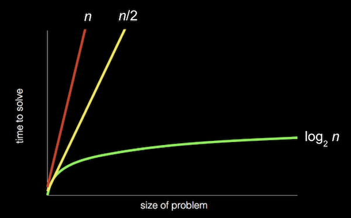

# CC50 - Harvard e Ifood

Curso introdutório de programação e resolução de problemas, uma parceria do Ifood com Harvard, e com a tradução e modulação de conteúdo da Fundação Estudar.
O curso conta com 10 módulos, sendo eles:
* Módulo 1: Linguagem C
* Módulo 2: Arrays
* Módulo 3: Algoritmos
* Módulo 4: Memória
* Módulo 5: Estruturas de Dados
* Módulo 6: Python
* Módulo 7: SQL
* Módulo 8: HTML, CSS e JavaScript
* Módulo 9: Flask
* Módulo 10: Ética

## Representando números
Desde pequenos, utilizamos o sistema númerico onde temos dez dígitos, de 0 a 9. Esse sistema é denominado decimal, ou base 10, uma vez que existem dez valores diferentes.

Já os computadores usam o sistema **binário**, ou base dois, contendo dois dígitos: **0 e 1**. Cada dígito binário também é chamado de **bit**.

Podemos pensar que nesse sistema, nós trabalhamos ligando e desligando alguma chave através desses 0 e 1, como se fosse um interruptor de energia.

Se imaginarmos um conjunto de três lâmpadas, podemos acendê-las em padrões diferentes e contar de 0 (com as três apagadas) a 7 (com as três acesas).

O que faz o mesmo papel (nos computadores) das lâmadas do exemplo acima, são os **transistores** que podem ser ligados e desligados para representar valores diferentes.

* Cada casa de um dígito representa uma potência de dez, pois há dez dígitos possíveis para cada casa. O lugar mais à direita é para 100, o do meio 101 e o lugar mais à esquerda 10²

```
    10² 10¹ 10⁰
    1   2   3
```

* Em binário, com apenas dois dígitos, temos potências de dois para cada valor de casa:

```
     2²   2¹   20⁰
     4     2     1
```

* Com todas as lâmpadas ou interruptores desligados, ainda teríamos um valor de 0:
```
2²   2¹   2⁰
0    0    0
```

* Agora, se mudarmos o valor binário para, digamos, 0 1 1 , o valor decimal seria 3, uma vez que somamos o 2 e o 1:
```
4   2   1
0   1   1
```

* Se tivéssemos mais lâmpadas, poderíamos ter um valor binário de 110010 , que teria o valor decimal equivalente a 50:
```
32   16   8    4    2     1
1    1    0    0    1     0
```

*Observe que 32 + 16 + 2 = 50 . Com mais bits, podemos contar até números ainda maiores.*

## Representando textos
Para representar as letras, tudo o que precisamos fazer é decidir como os números são mapeados para as letras.Alguns humanos, muitos anos atrás, decidiram coletivamente um mapeamento padrão de números em letras. A letra “A”, por exemplo, é o número 65, e “B” é 66 e assim por diante.

>[!NOTE]
>
>O mapeamento padrão, ASCII, também inclui letras minúsculas e pontuação.

Se recebêssemos uma mensagem de texto com um padrão de bits que tivesse os valores decimais 72 , 73 e 33, esses bits seriam mapeados para as letras HI!. Cada letra é normalmente representada com um padrão de oito bits, ou um byte, então as sequências de bits que receberíamos são 01001000 , 01001001 e 00100001.

A regra da representação através dos bits, também se aplica nos casos de imagens e vídeos. Nada mais são do que um conjunto de bytes.

## Algoritmos
Os humanos também podem seguir algoritmos, como receitas para cozinhar. Ao programar um computador, precisamos ser mais precisos com nossos algoritmos para que nossas instruções não sejam ambíguas ou mal interpretadas.

Nossa contribuição para o problema de encontrar o número de alguém seria a lista telefônica e um nome a ser procurado. Podemos abrir o livro e começar da primeira página, procurando um nome uma página de cada vez. Este algoritmo estaria correto, já que eventualmente encontraremos o nome que buscamos se ele estiver no livro.

Podemos folhear o livro duas páginas por vez, mas esse algoritmo não estará correto, pois podemos pular a página com nosso nome nela. Podemos consertar esse bug, ou engano, voltando uma página se formos longe demais, pois sabemos que a lista telefônica está classificada em ordem alfabética.

Outro algoritmo seria abrir a lista telefônica ao meio, decidir se nosso nome estará na metade esquerda ou na metade direita do livro (porque o livro está em ordem alfabética) e reduzir o tamanho do nosso problema pela metade. Podemos repetir isso até encontrar nosso nome, dividindo o problema pela metade a cada vez. Com 1.024 páginas para começar, precisaríamos apenas de 10 etapas de divisão ao meio antes de termos apenas uma página restante para verificar. 

Na verdade, podemos representar a eficiência de cada um desses algoritmos com um gráfico:



Nossa **primeira solução**, pesquisar uma página por vez, pode ser representada pela linha vermelha: nosso tempo para resolver aumenta linearmente à medida que o tamanho do problema aumenta. n é um número que representa o tamanho do problema, portanto, com n páginas em nossas listas telefônicas, temos que realizar até n etapas para encontrar um nome.

A **segunda solução**, pesquisar duas páginas por vez, pode ser representada pela linha amarela: nossa inclinação é menos acentuada, mas ainda linear. Agora, precisamos apenas de (aproximadamente) n / 2 etapas, já que viramos duas páginas de cada vez.

Nossa **solução final**, dividindo a lista telefônica ao meio a cada vez, pode ser representada pela linha verde, com uma relação fundamentalmente diferente entre o tamanho do problema e o tempo de resolvê-lo: logarítmica , já que nosso tempo de resolução aumenta cada vez mais lentamente conforme o tamanho do problema aumenta.

Em outras palavras, se a lista telefônica fosse de 1.000 para 2.000 páginas, precisaríamos apenas de mais uma etapa para encontrar nosso nome. Se o tamanho dobrasse novamente de 2.000 para 4.000 páginas, ainda precisaríamos de apenas mais uma etapa. A linha verde é rotulada *log2 n* , ou *log base 2 de n* , já que estamos dividindo o problema por dois em cada etapa.

## Pseudocódigo

Podemos escrever pseudocódigo, que é uma representação de nosso algoritmo em inglês preciso (ou alguma outra linguagem humana):

```
1 Pegue a lista telefônica
2 Abra no meio da lista telefônica
3 Olhe para a página
4 Se a pessoa estiver na página // Condicional
5    Ligar para pessoa // Método ou função
6 Caso contrário, se a pessoa estiver mais para o início do livro
7    Abrir no meio da metade esquerda do livro
8    Volte para a linha 3 // Loop
9 Caso contrário, se a pessoa estiver mais para o final do livro
10   Abrir no meio da metade direita do livro
11   Volte para a linha 3
12 Caso contrário
13   Desistir
```

