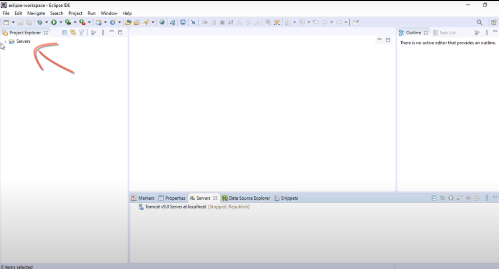
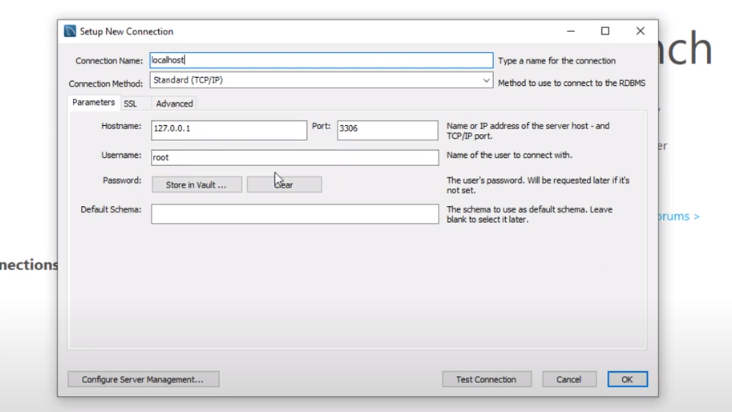
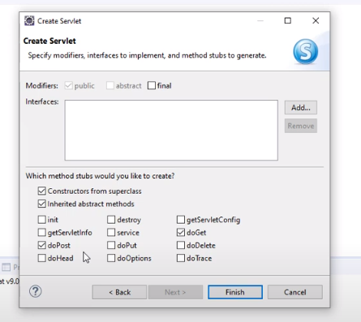
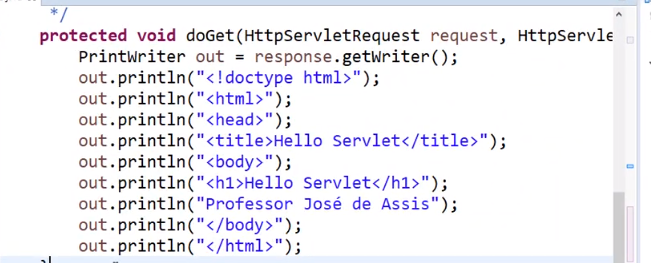

# Projeto Agenda em Java
Um projeto de agenda simples, para treinar conceitos de Java, servidor, banco de dados e web.

## Ferramentas utilizadas
* **JDK** - Java Development Kit, para criar os sistemas de software para a plataforma Java.
* **Eclipse** - IDE escolhida para o desenvolvimento.
* **Tomcat** - Servidor web Java ou container de Servlets.
* **MySQL** - Sistema de gerenciamento de banco de dados escolhido para o projeto.

### Tomcat
*Importante extrair o arquivo e deixa-lo na pasta raiz do computador, para melhor acesso.*

Para fazer a integração com o Eclipse basta ir na aba (ou configuração) **Servers**, e clicar no link apresentado para criar um novo servidor.

O tipo de servidor é **Apache**, e depois basta escolher a versão do Tomcat que foi baixada (Tomcat v9.0 Server, por exemplo). Também é possível mudar o nome do host (*localhost*, por padrão) e o nome do servidor (Tomcat v9.0 Server at localhost, idem).

Após isso, basta indicar o caminho da pasta onde você instalou (descompactou) o servidor (Nesse caso, na pasta raiz C). O servidor deve aparecer na aba Server, assim como uma pasta Servers será criada no Explorador de Arquivos:



Um ultima configuração precisa ser feita, clicando no servidor e abrindo o overview, marcar a opção em Server Locations (*Use Tomcat installation*). Basta salvar e dar sequência.

Caso queira conferir se esta tudo devidamente configurado e funcionando, basta criar um *Dynamic Web Project*. Na pasta WebContent criada, é só criar um arquivo HTML, executar e ver se ele funciona no localhost.

### MySQL
*Importante baixar a versão Comunnity do MySQL e também o Workbench*

A instalação do MySQL é simples, e é preferivel que se faça com opções costumizadas, escolhendo o que for necessário de acordo com o projeto ou maquina.
Para criar uma nova conexão, clique no sinal de "mais" e preencha as opções:



As configurações na imagem são padrão. Lembrando que o MySQL sempre vai pedir o usuário e senha.

### Servlets
Servlets são classes Java que recebem as requisições *http*, processa as informações e devolve o conteúdo dinâmicamente.

Para ver na prática basta criar um novo Dynamic Web Project, onde por padrão ele já será criado em uma pasta *src*. Precisamos também gerar um arquivo web.xml, para poder definir o mapeamento do servidor e definir o Servlet. 
* *Você pode encontrar esse arquivo indo em SeuProjeto/WebContent/WEB-INF/web.xml*

Na pasta *src* podemos criar um pacote de teste, e dentro dele criar um Servlet.

>[!NOTE]
>
>No Java, por boas práticas, nós definimos nomes de pacotes com letras minúsculas (*meuPacote*) e o nome de classes com letra maiúsculas (*MinhaClasse*).

Vale lembrar que o Eclipse nos da algumas opções para a criação do Servlet, como já definir os métodos *doPost* (Para requisições) e *doGet* (Para resposta):



No código, se formos até a parte onde está declarado o método *doGet* por exemplo, poderemos inserir uma página web (HTML) inteira, apenas fazendo referência a ela como no exemplo:

```
protect void doGet(HttpServletRequest request, HttpServletResponse response) {
    PrintWriter out = response.getWriter();
}
```

*No Eclipse, podemos importar qualquer tipo de recurso faltante através de Crtl + Shift + O*

>[!NOTE]
>
> * *HttpServletRequest* e *HttpServletResponse* estão criando dois objetos, um para req e outro para res.
> * Usando o objeto response(res), iremos imprimir com PrintWriter um código HTML.
> * A partir do código de exemplo, poderiamos montar o HTML igual a imagem abaixo.



Isso faria uma página web inteiramente dinâmica, mostrando assim a funcionalidade e execução de um Servlet (de uma maneira simples), sendo que o resultado seria apenas os "prints" e não todo o código já processado no servidor Java. 

### Java Server Pages
Uma página JSP, é um documento HTML que permite a execução de um código Java através de uma tag especial chamada *Scriplet* (Similar ao PHP). Páginas JSP são automaticamente convertidas em Servlet pelo Tomcat. O servidor sempre transforma uma página JSP em Servelt.

>[!NOTE]
>
> Uma recomendação é usar JSP para fazer a interface com o usuário e Servelts para a lógica do sistema.

Para fins de testes, podemos criar um novo Dynamic Web Project e gerar um arquivo web.xml, e na pasta WebContent criaremos um JSP File. Perceba que temos uma estrutura HTML, porém, antes de *'!DOCTYPE html'* nós temos:

```
<%@ page language="java" contentType="text/html; charset=utf-8 pageEncoding="utf-8" %>
```

As tags *<%@ %>* são Scriplets referentes as diretivas, que nesse caso estão configurando a codificão da página em utf-8.
Para rodar Java dentro de um código HTML, podemos utilizar Scriplets como *<% %>*, e que necessariamente precisam terminar com *;* no final do comando Java (ponto e vírgula dentro do Scriplet):

```
<body>
    <h1>Isso é um título</h1>
    <%out.println("Isso é um código Java.");%>
</body>
```

As tags de comentários não precisam de ponto e vírgula, e são declaradas assim:

```
<%-- Isso é um comentário --%>
```

Um elemento de expressão seria:

```
<%@ page import="java.util.Date"%> // Faz a importação da classe
<p>Data: <%=new Date()%></p> // Utiliza a classe Date
```

Um elemento de declaração seria:

```
<%! int contador=0 %>
```

>[!NOTE]
>
>*Apenas elementos com %= é que não fecham com ponto e vírgula*

#### Contador simples e didático:
```
<body>
    <h1>Contador de visitantes</h1>
    <p>Data: <%=new Date()%></p>
    <%!int contator=0>;%>
    <p>Visitas: <%=contador++%></p>
</body>
```